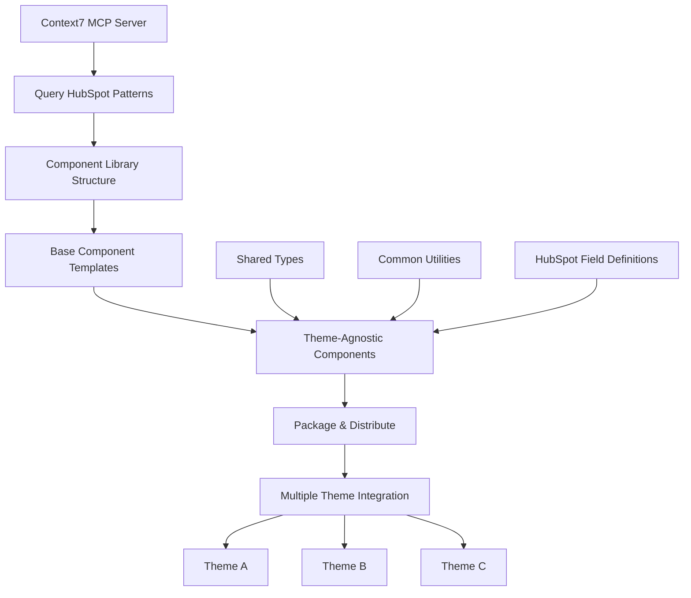

# Context7-Powered HubSpot Reusable Component Library Plan

This plan outlines the steps to build a reusable component library for HubSpot themes, leveraging Context7 for accelerated development and adherence to best practices. The focus will be on creating robust, theme-agnostic components that can be easily integrated into multiple HubSpot portals.

## Refined Architecture for Reusable Components



## Detailed Implementation Plan

The prioritized component types for initial development are:
1. Content blocks (testimonials, feature grids, image galleries)
2. Form components (contact, newsletter, lead generation)
3. Navigation components (headers, footers, breadcrumbs)
4. Hero sections and call-to-action components for landing pages

### Phase 1: Component Library Foundation

1.  **Setup Component Library Repository**
    *   Initialize a new repository for the reusable components.
    *   Utilize Context7 to gather initial HubSpot project structure patterns and best practices.
    ```bash
    # Initialize new repository for reusable components
    mkdir hubspot-component-library
    cd hubspot-component-library
    
    # Use Context7 to get HubSpot project structure patterns
    npx @upstash/context7-mcp
    ```

2.  **Query Context7 for Component Patterns**
    *   Access documentation from `/hubspot/cms-elevate-theme-public` to understand existing component structures.
    *   Extract reusable patterns from `/hubspot/jinjava` templates for HubSpot's templating language.
    *   Study field library implementations to understand how data is passed to components.

3.  **Create Library Structure**
    *   Establish a modular and scalable directory structure for the component library.
    ```
    hubspot-component-library/
    ├── src/
    │   ├── components/          # Reusable components (e.g., BaseButton, HeroSection, ContactForm, ImageGallery, TestimonialSlider)
    │   │   ├── BaseButton/
    │   │   ├── HeroSection/
    │   │   ├── ContactForm/
    │   │   ├── ImageGallery/
    │   │   └── TestimonialSlider/
    │   ├── types/              # Shared TypeScript type definitions for consistency
    │   ├── utils/              # Common utility functions
    │   ├── fields/             # HubSpot field definitions (JSON files for modules)
    │   └── themes/             # Theme-specific adaptations (e.g., CSS variables, wrapper components)
    ├── dist/                   # Directory for compiled/built components
    ├── docs/                   # Documentation for each component (usage, props, examples)
    ├── examples/               # Example implementations of components within a HubSpot context
    └── tests/                  # Unit and integration tests for components
    ```

### Phase 2: Core Reusable Components Development (Prioritized)

1.  **Base Component Template (Using Context7 Patterns)**
    *   Develop a foundational `BaseComponent` that all other components can extend, ensuring consistent styling and props handling.
    ```typescript
    // src/components/BaseComponent/index.tsx
    import React from 'react';
    import { HubSpotModuleProps, ComponentVariant } from '../../types';
    
    interface BaseComponentProps extends HubSpotModuleProps {
      variant?: ComponentVariant;
      theme?: string;
      customClasses?: string;
    }
    
    export const BaseComponent: React.FC<BaseComponentProps> = ({
      variant = 'default',
      theme = 'standard',
      customClasses = '',
      children,
      ...props
    }) => {
      const baseClasses = `base-component base-component--${variant} theme--${theme}`;
      const finalClasses = `${baseClasses} ${customClasses}`.trim();
    
      return (
        <div className={finalClasses} {...props}>
          {children}
        </div>
      );
    };
    ```

2.  **Reusable Content Blocks (Testimonials, Feature Grids, Image Galleries)**
    *   **Testimonial Component**: Display client testimonials with options for author, quote, and image.
    *   **Feature Grid Component**: Showcase features in a grid layout with icons, titles, and descriptions.
    *   **Image Gallery Component**: Present a collection of images with captions and lightbox functionality.

3.  **Reusable Form Components (Contact, Newsletter, Lead Generation)**
    *   **Contact Form**: Standard contact form with customizable fields.
    *   **Newsletter Signup**: Simple form for email subscriptions.
    *   **Lead Generation Form**: More complex form for capturing detailed lead information.

4.  **Reusable Navigation Components (Headers, Footers, Breadcrumbs)**
    *   **Header Component**: Customizable navigation bar with logo, menu items, and calls to action.
    *   **Footer Component**: Standard footer with copyright, links, and social media icons.
    *   **Breadcrumbs Component**: Display navigation path for improved user experience.

5.  **Reusable Hero Sections and Call-to-Action Components**
    *   **Hero Section**: Large, prominent sections with background images/videos, headings, and CTAs.
    *   **Call-to-Action (CTA) Button**: Customizable buttons for various purposes.

### Phase 3: HubSpot Field Integration

1.  **Generate Field Definitions (Using Context7 Examples)**
    *   Create corresponding `fields.json` files for each component, defining the module fields for HubSpot CMS.
    ```json
    // src/fields/hero-section.json (Example)
    [
      {
        "id": "heading",
        "name": "heading", 
        "label": "Heading",
        "required": true,
        "type": "text",
        "default": "Welcome to Our Site"
      },
      {
        "id": "subheading",
        "name": "subheading",
        "label": "Subheading", 
        "type": "richtext",
        "default": ""
      },
      {
        "id": "background_image",
        "name": "background_image",
        "label": "Background Image",
        "type": "image"
      },
      {
        "id": "cta_button",
        "name": "cta_button",
        "label": "Call to Action",
        "type": "group",
        "children": [
          {
            "id": "text",
            "name": "text",
            "label": "Button Text",
            "type": "text",
            "default": "Learn More"
          },
          {
            "id": "url", 
            "name": "url",
            "label": "Button URL",
            "type": "url"
          }
        ]
      }
    ]
    ```

### Phase 4: Multi-Theme Support

1.  **Theme Adaptation Layer**
    *   Implement a `ThemeAdapter` or similar mechanism to allow components to respond to different theme styles (e.g., via CSS variables or utility classes).
    ```typescript
    // src/themes/ThemeAdapter.tsx
    import React from 'react';
    import { ThemeVariant } from '../types';
    
    interface ThemeAdapterProps {
      theme: ThemeVariant;
      children: React.ReactNode;
    }
    
    export const ThemeAdapter: React.FC<ThemeAdapterProps> = ({ 
      theme, 
      children 
    }) => {
      const themeClasses = {
        standard: 'theme-standard',
        minimal: 'theme-minimal',
        corporate: 'theme-corporate', 
        creative: 'theme-creative'
      };
    
      return (
        <div className={`theme-wrapper ${themeClasses[theme]}`}>
          {children}
        </div>
      );
    };
    ```

2.  **CSS Variables for Theme Customization**
    *   Define a set of CSS variables to allow easy customization of component styles across different themes.
    ```css
    /* src/styles/themes.css */
    :root {
      --primary-color: #007bff;
      --secondary-color: #6c757d;
      --text-color: #333;
      --background-color: #fff;
    }
    
    .theme-minimal {
      --primary-color: #000;
      --secondary-color: #666;
      --text-color: #333;
      --background-color: #f8f9fa;
    }
    
    .theme-corporate {
      --primary-color: #1e3a8a;
      --secondary-color: #3b82f6;
      --text-color: #1f2937;
      --background-color: #ffffff;
    }
    ```

### Phase 5: Distribution & Integration

1.  **Build System for Multiple Themes**
    *   Set up a robust build process (e.g., using Rollup or Webpack) to compile components into a distributable format.
    ```json
    // package.json (Example scripts)
    {
      "name": "@yourorg/hubspot-components",
      "scripts": {
        "build": "npm run build:components && npm run build:themes",
        "build:components": "rollup -c rollup.config.js",
        "build:themes": "node scripts/build-themes.js",
        "generate:fields": "node scripts/generate-fields.js"
      }
    }
    ```

2.  **Integration Instructions for Each Theme**
    *   Provide clear instructions on how to install and integrate the component library into various HubSpot themes.
    ```bash
    # Install in HubSpot theme
    npm install @yourorg/hubspot-components
    
    # Import components
    import { HeroSection, ContactForm } from '@yourorg/hubspot-components';
    
    # Use in theme
    <HeroSection 
      heading="Welcome"
      theme="corporate"
      backgroundImage="/path/to/image.jpg"
    />
    ```

## Context7 Integration Benefits for This Plan

1.  **Pattern Discovery**: Utilizes Context7 to query and discover proven HubSpot component patterns, ensuring adherence to HubSpot's best practices and reducing development time.
2.  **Field Generation**: Leverages Context7 examples to accurately generate HubSpot field definitions (`fields.json`) for each component, streamlining the CMS integration process.
3.  **API Integration**: Provides access to HubSpot API examples for components requiring dynamic content or interactions (e.g., forms fetching data).
4.  **TypeScript Support**: Accesses Context7 for proper TypeScript type definitions from official HubSpot repositories, enhancing code quality and maintainability.
5.  **Best Practices**: Learns from HubSpot's own component architecture and development workflows via Context7, ensuring the reusable components are robust and future-proof.